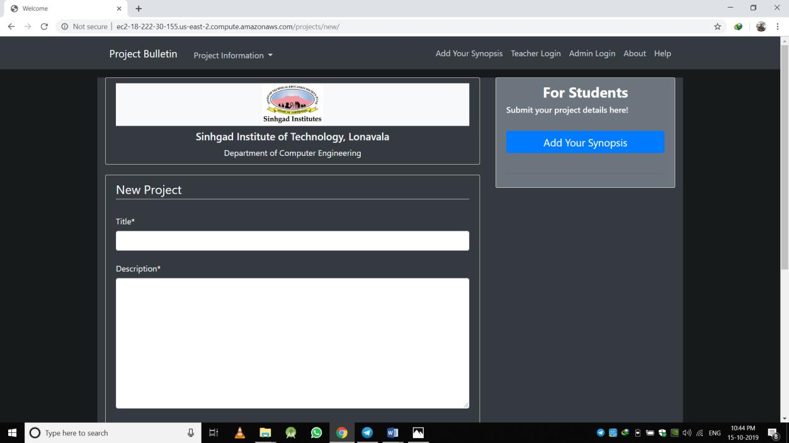
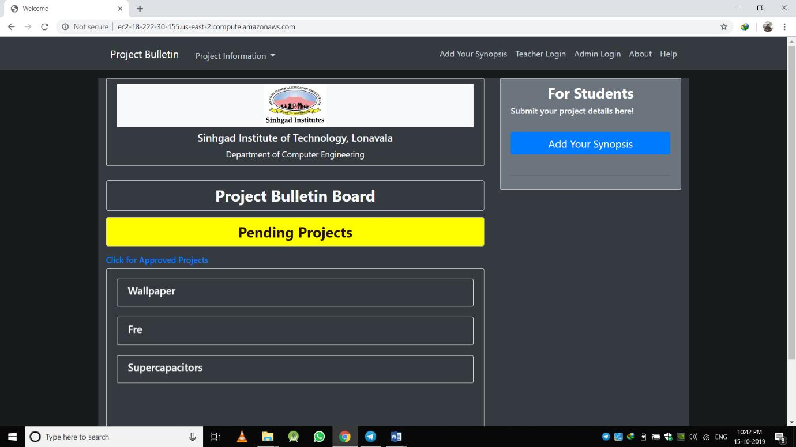
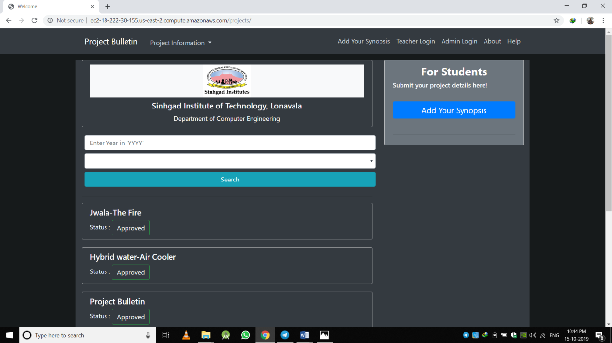
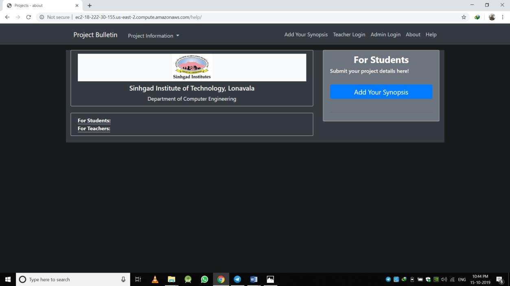
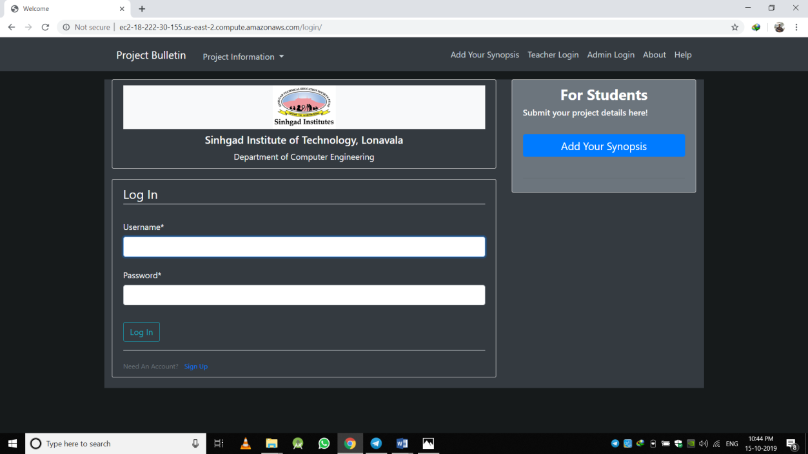
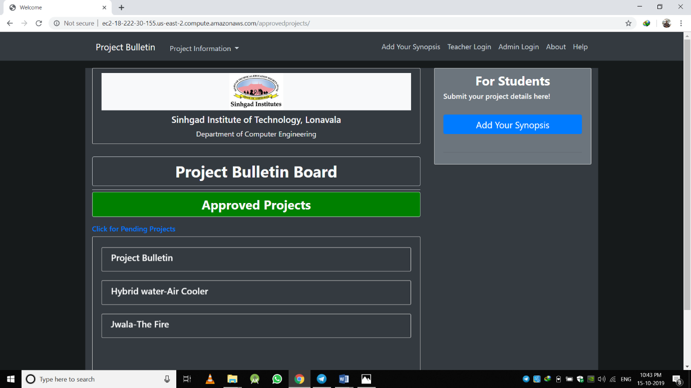
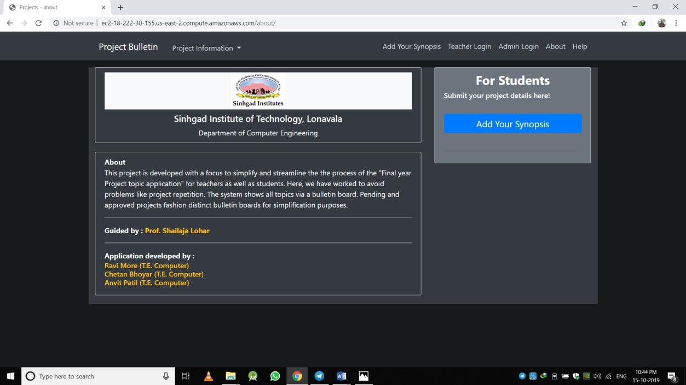
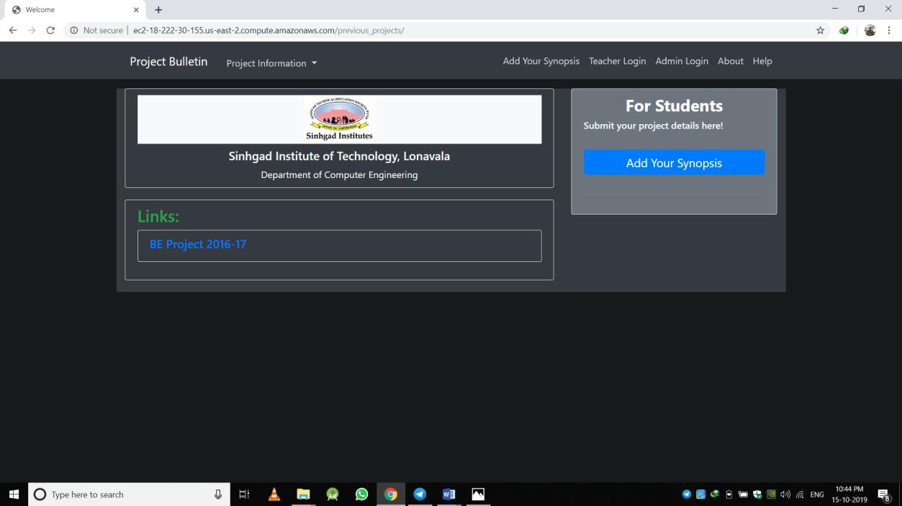

## Requirements
- python 3.6 or above
- MongoDB
  
## Install dependancies
```bash
    pip install -r requirements.txt 
```

## migrations
```bash
    python manage.py makemigrations
    python manage.py migrate
```

## Create superuser
```bash
    python manage.py createsuperuser
```

## Go to admin login
<a href="http://127.0.0.1:8000/admin/login/">http://127.0.0.1:8000/admin/login/</a>


## Teacher login steps
- create user for teacher
- Grant all permissions to the user
- user created for teachers can be used for project approval and to update add important links

# Students
- students can add there project synopsis

# Screenshots








